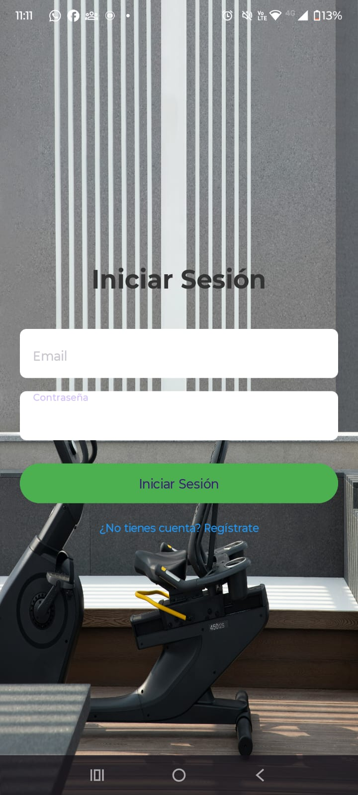
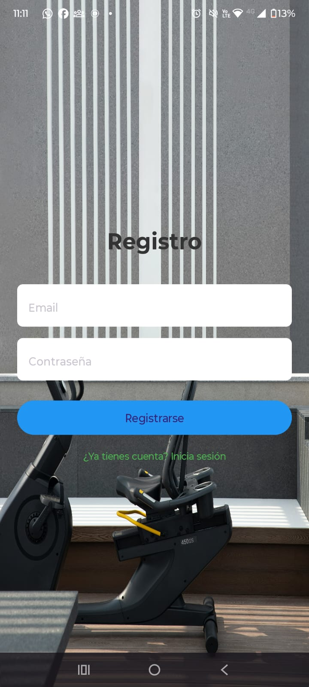
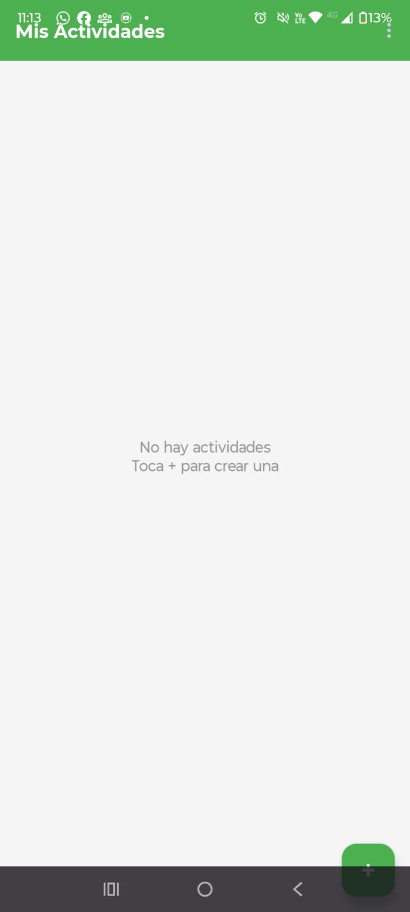
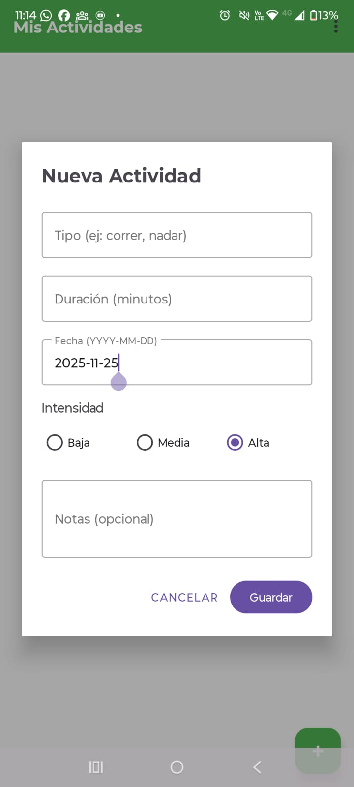
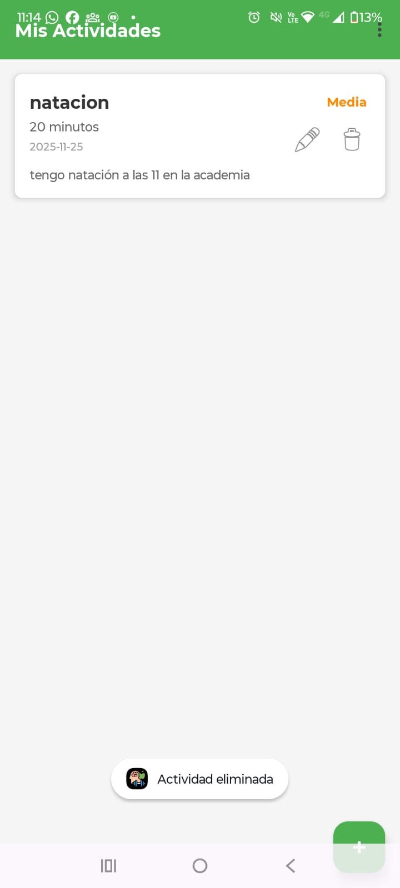

# Mis Actividades - Activity Tracker App

Una aplicación Android para el seguimiento y gestión de actividades físicas desarrollada en Java con Android Studio. Permite a los usuarios registrar, consultar, editar y eliminar sus entrenamientos con información detallada como tipo de actividad, duración, intensidad y notas personales.

## Capturas de Pantalla

<div align="center">
  
  
  
  
  
</div>
## Características Principales

* **Sistema de Autenticación Completo**
  * Registro de nuevos usuarios
  * Inicio de sesión con validación
  * Gestión de tokens JWT
  * Persistencia de sesión con SharedPreferences
* **Gestión de Actividades Físicas (CRUD)**
  * Crear nuevas actividades con detalles completos
  * Visualizar lista de actividades en cards interactivas
  * Editar actividades existentes
  * Eliminar actividades con confirmación
* **Información Detallada por Actividad**
  * Tipo de actividad (correr, nadar, gimnasio, etc.)
  * Duración en minutos
  * Fecha de realización
  * Nivel de intensidad (Baja, Media, Alta) con código de colores
  * Notas adicionales opcionales
* **Interfaz de Usuario Material Design**
  * Diseño moderno y limpio
  * Animaciones fluidas
  * Temas personalizados
  * Iconos y colores según intensidad

## Tecnologías Utilizadas

### Frontend (Android)

* **Lenguaje** : Java
* **IDE** : Android Studio
* **API Mínima** : Android 5.0 (API 21)
* **Librerías principales** :
* [Retrofit 2](https://square.github.io/retrofit/) - Cliente HTTP para consumir API REST
* [OkHttp](https://square.github.io/okhttp/) - Interceptores y logging de peticiones HTTP
* [Gson](https://github.com/google/gson) - Serialización/deserialización JSON
* [Material Components](https://material.io/develop/android) - Componentes de UI Material Design
* RecyclerView - Listas eficientes y scrollables
* SharedPreferences - Almacenamiento local de sesión

### Backend (API REST)

* Desarrollado por el equipo de backend
* Desplegado en [Koyeb](https://www.koyeb.com/)
* Base URL: `https://stable-brandice-santiagobedoya-803c1333.koyeb.app`

## Requisitos Previos

* Android Studio Arctic Fox o superior
* JDK 8 o superior
* Dispositivo Android con API 21+ o emulador
* Conexión a Internet para consumir la API

## Instalación y Configuración

### 1. Clonar el Repositorio

```bash
git clone https://github.com/CristianDAgon/mis-actividades.git
cd mis-actividades
```

### 2. Abrir el Proyecto en Android Studio

* Abre Android Studio
* Selecciona "Open an Existing Project"
* Navega a la carpeta del proyecto clonado
* Espera a que Gradle sincronice las dependencias

### 3. Configurar la URL de la API (Opcional)

Si necesitas cambiar la URL del backend, edita el archivo `RetrofitClient.java`:

```java
private static final String BASE_URL = "TU_URL_AQUI";
```

### 4. Compilar y Ejecutar

* Conecta un dispositivo Android físico o inicia un emulador
* Haz clic en el botón "Run"  en Android Studio
* Selecciona el dispositivo de destino
* Espera a que la aplicación se instale y se ejecute

## Estructura del Proyecto

```
com.example.proyectofinal2pdd/
│
├── activities/                    # Activities de la aplicación
│   ├── ActivitiesListActivity.java    # Pantalla principal con lista
│   ├── RegisterActivity.java          # Pantalla de registro
│   ├── CreateActivityDialog.java      # Diálogo para crear/editar
│   └── ActivitiesAdapter.java         # Adaptador del RecyclerView
│
├── api/                          # Capa de red y API
│   ├── ApiService.java               # Interface con endpoints
│   └── RetrofitClient.java           # Configuración de Retrofit
│
├── models/                       # Modelos de datos
│   ├── Activity.java                 # Modelo de actividad física
│   ├── User.java                     # Modelo de usuario
│   └── AuthResponse.java             # Respuesta de autenticación
│
├── utils/                        # Utilidades
│   └── SessionManager.java           # Gestión de sesión y tokens
│
└── MainActivity.java             # Pantalla de login
```

## Endpoints de la API

### Autenticación

```
POST /auth/sign-in      # Iniciar sesión
POST /auth/sign-up      # Registrar usuario
```

### Actividades (Requieren autenticación)

```
GET    /activities         # Obtener todas las actividades del usuario
GET    /activities/{id}    # Obtener actividad por ID
POST   /activities         # Crear nueva actividad
PATCH  /activities/{id}    # Actualizar actividad
DELETE /activities/{id}    # Eliminar actividad
```

### Ejemplo de Request Body (Crear Actividad)

```json
{
  "type": "Natación",
  "durationMinutes": 45,
  "date": "2025-11-25",
  "intensity": "Media",
  "notes": "Entrenamiento de técnica de crol"
}
```

### Headers Requeridos

```
Content-Type: application/json
Authorization: Bearer {token}    // Para endpoints protegidos
```

## Funcionalidades Principales

### Autenticación

1. **Registro** : Los nuevos usuarios pueden crear una cuenta con email y contraseña
2. **Login** : Validación de credenciales y obtención de token JWT
3. **Persistencia** : La sesión se mantiene incluso al cerrar la app
4. **Logout** : Cierre de sesión y limpieza de datos locales

### Gestión de Actividades

1. **Crear** : Botón flotante (+) para agregar nuevas actividades
2. **Listar** : Vista en cards con toda la información relevante
3. **Editar** : Botón de edición (lápiz) en cada card
4. **Eliminar** : Botón de eliminación (papelera) con diálogo de confirmación
5. **Colores por Intensidad** :

* 🔴 Rojo: Alta intensidad
* 🟠 Naranja: Media intensidad
* 🟢 Verde: Baja intensidad

## Características de la UI

* **Material Design 3** : Componentes modernos y consistentes
* **TextInputLayout** : Campos de texto con validación visual
* **FloatingActionButton** : Botón de acción flotante para crear actividades
* **RecyclerView** : Lista eficiente con ViewHolder pattern
* **Custom Dialog** : Diálogo a pantalla completa para crear/editar
* **Progress Indicators** : Indicadores de carga durante peticiones de red
* **Empty State** : Mensaje cuando no hay actividades registradas

## Seguridad

* Almacenamiento seguro de tokens con SharedPreferences
* Validación de campos en el frontend
* Interceptor de Retrofit para agregar automáticamente el token de autorización
* Manejo de errores y timeouts de red
* Cierre de sesión con limpieza completa de datos

## Manejo de Errores

La aplicación maneja los siguientes escenarios:

* Credenciales incorrectas
* Campos vacíos o inválidos
* Errores de red o timeout
* Respuestas HTTP no exitosas
* Token expirado o inválido

## Compatibilidad

* **API Mínima** : Android 5.0 (Lollipop - API 21)
* **API Target** : Android 14 (API 34)
* **Orientación** : Portrait (vertical)
* **Resoluciones** : Adaptable a diferentes tamaños de pantalla

## Equipo de Desarrollo

### Frontend (Android)

* **Desarrollador Android** : Cristian David Gonzalez
* Implementación de la UI/UX
* Integración con API REST
* Gestión de estado y navegación

### Backend (API REST)

* **Desarrollador Backend** : Santiago Bedoya Arcila
* Desarrollo de endpoints REST
* Gestión de base de datos
* Autenticación JWT
* Despliegue en Koyeb

## Licencia

Este proyecto fue desarrollado como proyecto final para la materia Programación de Dispositivos Moviles
